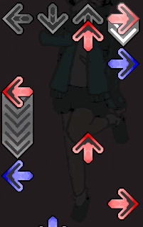

# Hojins-Minimal-DDR-Note
This is a minimal and function focused version of Peter's DDR Note noteskin for the rhythm game StepMania (and StepMania adjacent games). Assets from HURG-IIDX's customizable noteskins were used here as well. 

To use the noteskin, extract the [ddr-minimal](ddr-minimal) folder into the Noteskins folder in StepMania. 

## Changes
- Only Marvelous judgement notes will have the bright spiked explosion effects.
- Hold bodies were simplified. 
- Hold heads are tap notes for better clarity.
- Made slight visual changes to explosions and notes.
- Fixed bottomcaps of hold and roll notes being misaligned by a few pixels. 

### Hojins-Minimal-DDR-Note

### Peters-DDR-Note

## Credits / Attributions
This is basically a fork of Peter's DDR Note noteskin from [Peters-Noteskins](https://github.com/Pete-Lawrence/Peters-Noteskins) repo. 

Hold / roll bodies and bottomcaps from HURG-IIDX's [Noteskin-Workshop-Dancegroove](https://github.com/HURG-IIDX/Noteskin-Workshop-DanceGroove) repo. 

Special thanks to Max for teaching me about [LICEcap](https://www.cockos.com/licecap/)! It's a lifesaver for making gifs. 
